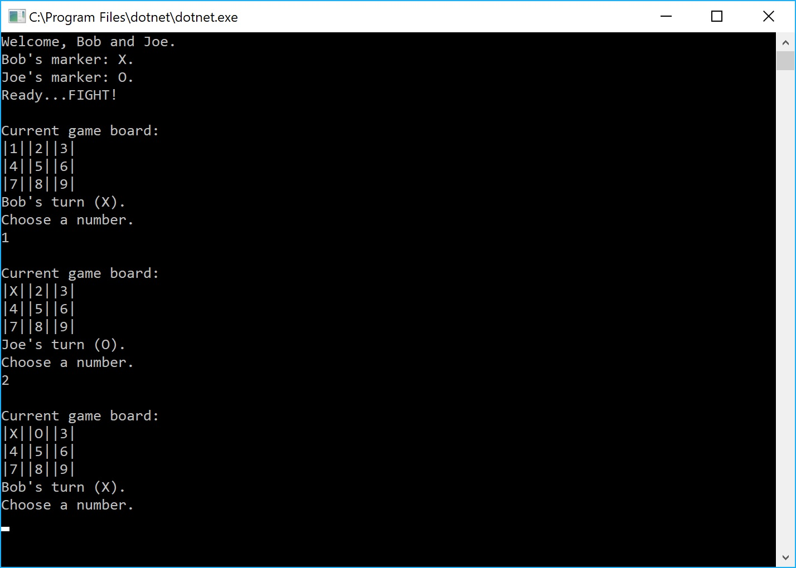

# Lab04-Tic-Tac-Toe
 CODE: Classes &amp; Objects (tic-tac-toe) assignment for Code Fellows 401 C#/ASP.NET course

**Author**: Earl Jay Caoile  
**Version**: 1.0.0

## Overview
This console app lets 2 users play a tic tac toe game. It lets one user choose a space to mark and switches to the next user until the game is over (someone wins or the board is full).

## Getting Started
The following is required to run the program.
1. Visual Studio 2017 
2. The .NET desktop development workload enabled
3. No External NuGet packages are required for this application. 

## Example

## Program Path
 - enter two names for game
 - choose spaces to place to marker
 - after game, decide to play a new game or quit

## Architecture
This application is created using ASP.NET Core 2.0 Console applicaitons.  
*Language*: C#  
*Type of Applicaiton*: Console Application  

## Change Log
06-10-2018 4:30 PM - initial scaffolding
06-10-2018 6:00 PM - board properly updating with markers on input
06-10-2018 10:00 PM - properly detecting winner or draw
06-11-2018 9:30 AM - refactored methods to work with testing
06-11-2018 10:30 AM - refactored classes to work with testing
06-11-2018 11:30 AM - testing complete
06-11-2018 12:00 PM - finished readme

