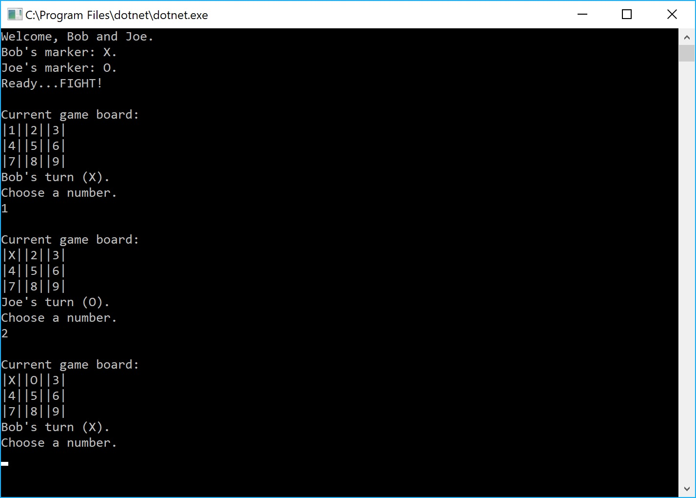

# Lab04-Tic-Tac-Toe
 CODE: Classes &amp; Objects (tic-tac-toe) assignment for Code Fellows 401 C#/ASP.NET course

**Author**: Earl Jay Caoile  
**Version**: 1.0.0

## Overview
This console app lets 2 users play a tic tac toe game. It lets one user choose a space to mark and switches to the next user until the game is over (someone wins or the board is full).

## Getting Started
The following is required to run the program.
1. Visual Studio 2017 
2. The .NET desktop development workload enabled
3. No External NuGet packages are required for this application. 

## Example

## Architecture

This application is created using ASP.NET Core 2.0 Console applicaitons.  
*Language*: C#  
*Type of Applicaiton*: Console Application  

## Change Log
06-07-2018 2:30 PM - initial scaffolding

